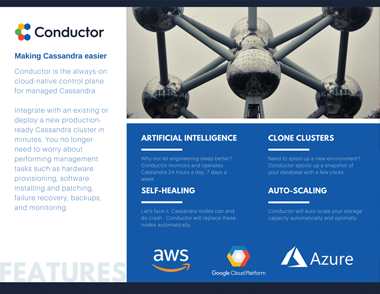

<h1 align="center">
   
  
   
   
  The always-on control plane for managed Cassandra.
   
   
</h1>

<h4 align="center"><a href="https://runconductor.io?utm_source=github&utm_medium=mktg-site&utm_campaign=v1">Conductor</a> is a scalable, fault tolerant Cassandra as Service software platform. It makes running Cassandra in production safe and reliable. It supports multiple cloud providers (Amazon Web Services, Google Cloud Platform), and on-premise hardware.</h4>

  <a href="#about-conductor">About Conductor</a> •
  <a href="#key-features">Key Features</a> •
  <a href="#request-a-demo">Request a Demo</a> •
  <a href="#contact-us">Contact Us</a> •
  <a href="#threecomma.io">ThreeComma.io</a>

  

## About Conductor

**Your time is precious. Let Conductor do the heavy lifting.**

Introducing Conductor — the always-on control plane for managed Cassandra.

Running Cassandra in the cloud just got a whole lot easier by utilizing the power of Artificial Intelligence. Conductor makes decisions just like a human would to manage your clusters.

Integrate with an existing or deploy a new production ready Cassandra cluster in minutes. You no longer need to worry about performing management tasks such as hardware provisioning, software installing and patching, failure recovery, backups, and monitoring.

Conductor is an opinionated solution optimized for performance and value.

**Supports:**

- Kubernetes
- ECS
- On-premise
- Amazon Web Services
- Google Cloud Platform
- Microsoft Azure

**Feature rich and affordable:**

- Supports Apache Cassandra and Datastax Enterprise Cassandra
- Automated backups
- Clone clusters in minutes
- Auto-scaling
- Pluggable API

Our many years of expertise and knowledge have been baked into Conductor to simplify and remove the stress of working with Cassandra.

## Key Features

  

- Cloud or On-Prem
  - Amazon Web Services
  - Google Cloud Platform
  - Microsoft Azure
  - On-Prem
- 100% Secure
  - Conductor is installed on your platform and run on your provisioned hardware behind your ACLs. Conductor _is not_ a remote dashboard.
- Artificial intelligence
  - Why not let engineering sleep better? Conductor monitors and operates Cassandra 24 hours a day, 7 days a week.
- Self-Healing
  - Let's face it, Cassandra nodes can and do crash. Conductor will replace these nodes automatically.
- Clone Clusters
  - Need to spool up a new environment? Conductor spools up a snapshot of your database with a few clicks.
- Auto-Scaling
  - Conductor will auto-scale your storage capacity automatically and optimally.

## Request a Demo

[Request a demo](https://runconductor.io/contact.html?utm_source=github&utm_medium=mktg-site&utm_campaign=v1)

## Contact Us

[hello@runconductor.io](mailto:hello@runconductor.io)

## ThreeComma.io

Conductor is a [ThreeComma](https://threecomma.io?utm_source=github&utm_medium=mktg-site&utm_campaign=v1#contact) technology.

ThreeComma helps improve efficiencies and reduce expenses relating to cloud services + storage through custom technologies and consulting.

---

> [runconductor.io](https://runconductor.io/contact.html?utm_source=github&utm_medium=mktg-site&utm_campaign=v1) &nbsp;&middot;&nbsp;
> Twitter [@conductorio](https://twitter.com/conductorio)

> [threecomma.io](https://threecomma.io?utm_source=github&utm_medium=mktg-site&utm_campaign=v1#contact) &nbsp;&middot;&nbsp;
> GitHub [@threecomma.io](https://github.com/threecommaio) &nbsp;&middot;&nbsp;
> Twitter [@threecommaio](https://twitter.com/threecommaio)
